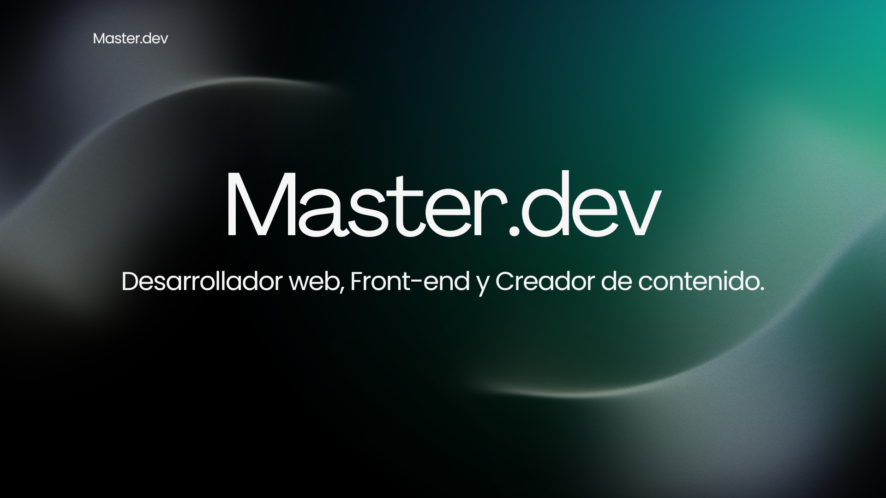

<h1 align="center">¡Hi!, my name is: <a href="https://github.com/Aryagm">Cristopher Fuentes<a></h1>
<h3 align="center">I'm Web Developer, Frontend and content creator🌟.</h3>

 &nbsp;***About me***

I'm an 18-year-old self-taught developer, passionate about programming and always eager to learn. I specialize in Frontend development and also have experience with Backend technologies. I'm currently available for any type of work to gain experience and grow professionally.
* **I am interested in Web designing and IOS/Android developer a future**

- 🌱 I’m currently learning Frontend Development and other programming languages for Backend

- 📫 How to reach me **cristopherfm21.5@gmail.com**

- ⚡ Fun fact :- Food and Coding🐞 are the reasons to live.

<h2> My social networks </h2>

  

 
 
<h2> Skills  </h2>

      <a href="https://sass-lang.com" target="_blank" rel="noreferrer"> 
 

<h2> Contact:  </h2>

[_-D14836?style=for-the-badge&logo=gmail&logoColor=white&labelColor=101010)](mailto:braismoure@mouredev.com)
